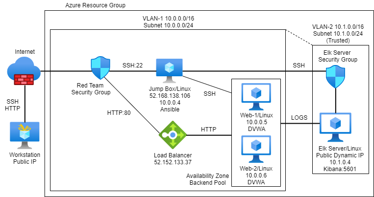
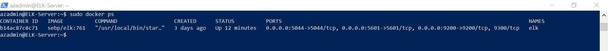

# Project1-Elk-Stack
Deploy an ELK stack to monitor operating conditions on vulnerable web servers.

## Automated ELK Stack Deployment

The files in this repository were used to configure the network depicted below.

These files have been tested and used to generate a live ELK deployment on Azure. They can be used to either recreate the entire deployment pictured above. Alternatively, select portions of the YAML files may be used to install only certain pieces of it, such as Filebeat.

  - configure-dvwa.yml
  - configure-elk.yml
  - filebeat-playbook.yml
  - filebeat-config.yml
  - metricbeat-playbook.yml
  - metricbeat-config.yml

This document contains the following details:
- Description of the Topology
- Access Policies
- ELK Configuration
  - Beats in Use
  - Machines Being Monitored
- How to Use the Ansible Build

### Description of the Topology

The main purpose of this network is to expose a load-balanced and monitored instance of DVWA, the D*mn Vulnerable Web Application.

Load balancing ensures that the application will be highly available, in addition to restricting access to the network.
- "Load balancing lets you evenly distribute network traffic to prevent failure caused by overloading a particular resource. This strategy improves the performance and availability of applications, websites, databases, and other computing resources. It also helps process user requests quickly and accurately [ibm.com - Jun 10,2019]." The advantage in a jump box is that it allows an internet-facing secure access point as a gateway to perform admin tasks in the virtual network.
   Integrating an ELK server allows users to easily monitor the vulnerable VMs for changes to hardware metrics and updated system logs.
- Filebeat watches for new log events and the resulting files and transmits them to ELK.
- Metricbeat records CPU usage or memory load based on the services being used and forwards the data to ELK.

The configuration details of each machine may be found below.

| Name       | Function   | IP Address | Operating System |
|------------|------------|------------|------------------|
| Jump Box   | Gateway    | 10.0.0.4   | Linux            |
| Web-1      | DVWA       | 10.0.0.5   | Linux            |
| Web-2      | DVWA       | 10.0.0.6   | Linux            |
| ELK Server | Monitoring | 10.1.0.4   | Linux            |

### Access Policies

The machines on the internal network are not exposed to the public Internet. 

Only the provisioning machine can accept connections from the Internet. Access to this machine is only allowed from the following IP addresses:
- Only the public IP address of the administrator machine.
Machines within the network can only be accessed by the jump box provisioner.
- The jump box (10.0.0.4) is allowed to access the ELK VM via the established trust between two virtual networks. 

A summary of the access policies in place can be found in the table below:

| Name       | Publicly Accessible | Allowed IP Addresses |
|------------|---------------------|----------------------|
| Jump Box   | Yes                 | Admin Public IP only |
| Web-1      | No                  | 10.0.0.4             |
| Web-2      | No                  | 10.0.0.4             |
| Elk Server | No                  | 10.0.0.4             |

### Elk Configuration

Ansible was used to automate configuration of the ELK machine. No configuration was performed manually, which is advantageous when repetitive tasks need to be deployed for many machines in a virtual network.

The playbook implements the following tasks:
- Use remote admin to activate docker and install python module.
- Allocate adequate memory to system services.
- Download and install an elk docker container utilizing published ports 5601, 9200 and 5044.

The following screenshot displays the result of running `docker ps` after successfully configuring the ELK instance.

### Target Machines & Beats
This ELK server is configured to monitor the following machines:
- Web-1 10.0.0.5
- Web-2 10.0.0.6

We have installed the following Beats on these machines:
- Web-1 10.0.0.5: filebeat, metricbeat
- Web-2 10.0.0.6: filebeat, metricbeat

These Beats allow us to collect the following information from each machine:
- filebeat: gathers logs based on system events, ex. - admin sudo command usage instances, ssh login attempts (success rate and location), and the creation of new users and groups.
- metricbeat: gathers statistics on hardware performance, ex. - cpu, disk i/o and memory, number of containers.

### Using the Playbook
In order to use the playbook, you will need to have an Ansible control node already configured. Assuming you have such a control node provisioned: 

SSH into the control node and follow the steps below:
- Copy the YAML playbook file to the roles directory in the Ansible container.
- Update the YAML config file to include pertinent settings such as host type, IP, appropriate ports and credential information where appropriate.
- Run the playbook, and navigate to either the internet-facing URLs for DVWA or Kibana, or from Jump Box Provisioner Ansible container (SSH to ELK or Web hosts, run 'sudo docker ps' to verify image information), to check that the installation worked as expected.

- (name)beat playbooks are denoted by (name)beat-playbook.yml files. These files exist in: Jump Box Provisioner Ansible container /etc/ansible/roles directory.
- Jump Box Provisioner Ansible container /etc/ansible/ contains a hosts file for denoting destination groups and IPs. ex., [webservers] contain the IPs for Web-1 and Web-2, including the ansible python interpreters to process YAML commands, as well as [elk], server IP and python interpreter. Jump Box Provisioner Ansible container /etc/ansible/files directory includes (name)beat-config.yml files, configuration settings (such as hostname and port, user credentials) specific to the type of beat being deployed. 
- From the public administrator workstation, browse http://(current dynamic public IP of ELK server):5601/app/kibana#/home to verify server status. Note this is only accessible from the IP specified in the security group and the ELK-Server VM must be running.

- From Jump Box Provisioner Ansible container /etc/ansible/roles directory, deploy desired playbook using command:
   ansible-playbook (name)beat-playbook.yml

### Supplemental 

Learn more about the use of [Containers in Cloud Security](https://github.com/isejy07/Project1-Elk-Stack/blob/main/Interview/cloud_security_containers.docx)

